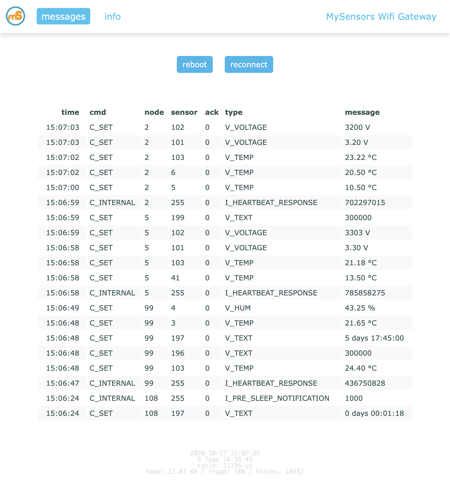

# GatewayWemosD1Mini

MySensors Gateway with logging using 
* event-based responsive web ui and 
* telnet interface and 
* pushover.net notifications

    

## config / credentials

Create a file "credentials.h" containing the following data
```
   #define MY_WIFI_SSID "ssid"
   #define MY_WIFI_PASSWORD "******"
   const char *_token = "******";   // for pushover.net 
   const char *_user = "******";    // for pushover.net 
```

## platformio

   platformio.ini is available incl. OTA support and local serial debugging (using serial port)

## cli   
   `arduino-cli lib install MySensors`   
   `arduino-cli compile -v --fqbn esp8266:esp8266:d1_mini /path/to/main.cpp (should be then better be renamed to *.ino)`

### OTA: 
        python espota.py -d  -i 192.168.2.221 -f /path/to/bin/GatewayWemosD1Mini.ino.bin
   Serial: 
```
      ls /dev/cu.*   
      ./esptool -vv -cd nodemcu -cb 115200 -cp /dev/cu.usbserial-1420 -ca 0x00000 -cf ./GatewayWemosD1Mini.ino.bin
```

## description 
   The GatewayWemosD1Mini sends data received from sensors to the WiFi link.   
   The gateway also accepts input on ethernet interface, which is then sent out to the radio network.   

   LED purposes:
   * To use the feature, uncomment any of the MY_DEFAULT_xx_LED_PINs in your sketch, only the LEDs that is defined is used.
   * RX (green) - blink fast on radio message recieved. In inclusion mode will blink fast only on presentation recieved
   * TX (yellow) - blink fast on radio message transmitted. In inclusion mode will blink slowly
   * ERR (red) - fast blink on error during transmission error or recieve crc error

###   for wiring instructions, see    
*   https://www.mysensors.org/build/esp8266_gateway
*   https://www.mysensors.org/build/advanced_gateway
*   https://github.com/mysensors/MySensors/blob/development/examples/GatewayESP8266OTA/GatewayESP8266OTA.ino
*   https://github.com/mysensors/MySensors/blob/master/examples/GatewayESP8266/GatewayESP8266.ino
*   https://www.wemos.cc/product/d1-mini.html

### connecting the radio

|   nRF24L01+  | ESP8266     |  Wemos D1 mini    | barebone | 
| ----  | ---- | ---- | ---- |  
|   VCC        |  VCC         |  VCC |  | 
|   CE         |  GPIO4       |  D2 |  | 
|   CSN/CS     |  GPIO15      |  D8    |            via 10K pulldown resistor to GND | 
|   SCK        |  GPIO14      |  D5 |  | 
|   MISO       |  GPIO12      |  D6 |  | 
|   MOSI       |  GPIO13      |  D7 |  | 
|   GND        |  GND         |  GND |  | 
|              |  CH_PD       |         |           via 10K resistor to VCC | 
|              |  GPIO2       |  D4        |        via 10K resistor to VCC | 
|              |  GPIO0       |  D3           |     via 10K resistor to VCC, and via switch to GND ('bootload switch') | 
|              |  GPIO16      |  D0              |  free | 
|              |  GPIO5       |  D1               | free | 

   Inclusion mode button:
   - Connect GPIO5 via switch to GND ('inclusion switch')

   The "barebone" ESP modules, like ESP-12E, require a certain pin configuration to download code,
   and another one to run code.
   Connect REST (reset) via 10K pullup resistor to VCC, and via switch to GND ('reset switch')
   Connect GPIO15 via 10K pulldown resistor to GND
   Connect CH_PD via 10K resistor to VCC
   Connect GPIO2 via 10K resistor to VCC
   Connect GPIO0 via 10K resistor to VCC, and via switch to GND ('bootload switch')

   // Internal onboard LED is PIN 16
```
   #define MY_DEFAULT_ERR_LED_PIN D10  // Error led pin (Red)
   #define MY_DEFAULT_RX_LED_PIN  D9  // Receive led pin (Yellow)
   #define MY_DEFAULT_TX_LED_PIN  D1  // Transmit led pin (Green)
```

## javascript hints
*   https://stackoverflow.com/a/2931108/10590793
*   https://stackoverflow.com/questions/1583123/circular-buffer-in-javascript
