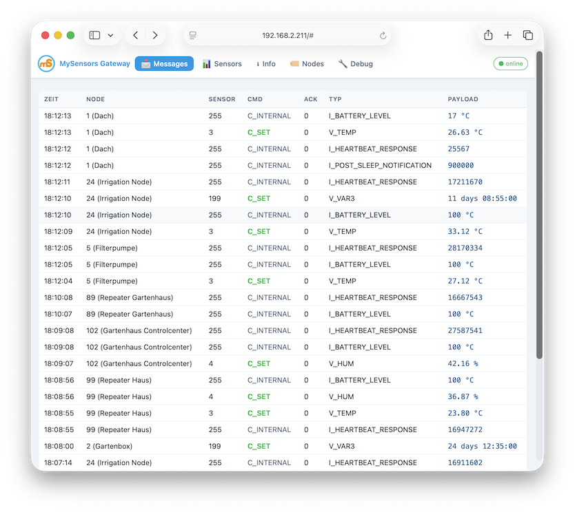
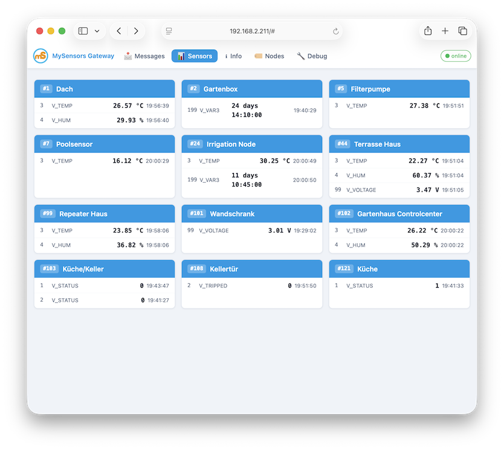
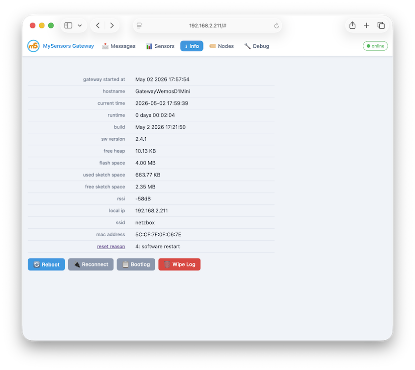
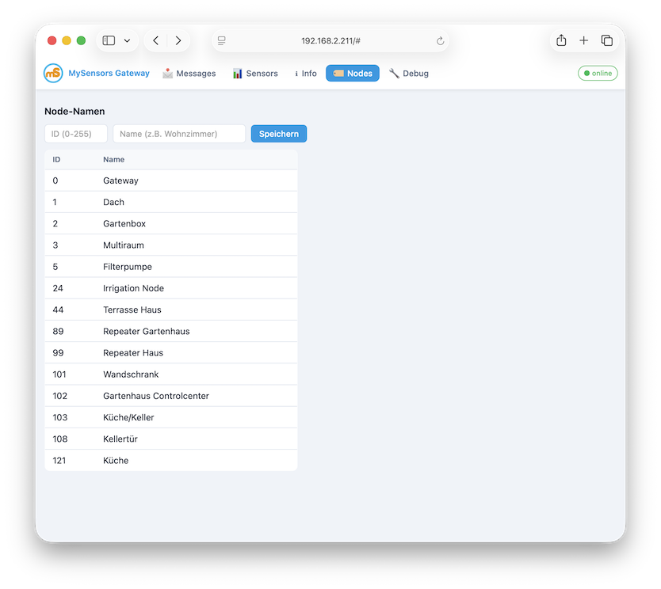
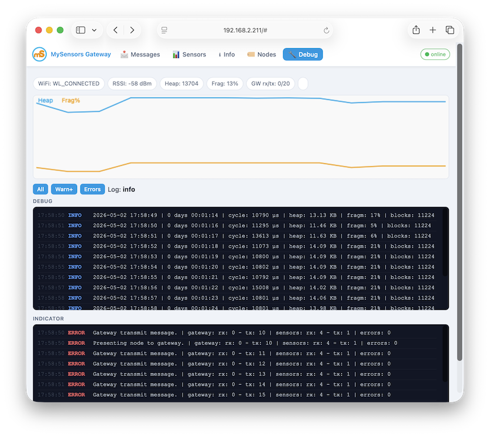

# GatewayESP32

MySensors WiFi Gateway auf Basis eines **ESP32 DevKit (ESP32-WROOM)** mit moderner Web-UI, Telnet-Interface und Pushover-Benachrichtigungen.

Version: **2.4.1**

## Features

- 📡 **MySensors WiFi-Gateway** — empfängt nRF24L01+-Funknachrichten und leitet sie ins Netzwerk weiter
- 🌐 **Moderne Single-Page Web-UI** (5 Tabs, Server-Sent Events, kein Polling)
- 📟 **Telnet-Interface** für Live-Debugging
- 🔔 **Pushover-Benachrichtigungen** (optional)
- 🕐 **NTP-Zeitsynchronisation**
- ⚡ **OTA-Updates** über PlatformIO oder `espota.py`
- 💾 HTML/CSS/JS vollständig in PROGMEM (Flash) — kein RAM-Verbrauch für die UI

## Web-UI

Die Web-Oberfläche ist über `http://<gateway-ip>/` erreichbar und enthält fünf Tabs:

| Tab | Inhalt |
|-----|--------|
| **📨 Messages** | Live-Tabelle der letzten 30 MySensors-Nachrichten (Zeit, Node, Sensor, Cmd, Typ, Payload) |
| **📊 Sensors** | Pro-Node-Karten mit dem letzten empfangenen Wert (`C_SET`) je Sensor inkl. Zeitstempel — Daten leben im Browser-Cache, kein ESP-RAM |
| **ℹ️ Info** | Gateway-Statistiken (Heap, RSSI, Rx/Tx-Zähler) + Aktionen: Reboot, Reconnect, Bootlog, Log löschen |
| **⚙️ Settings** | Laufzeit-Einstellungen (Intervall, Debug, Live-Updates, Telnet, OTA-Fenster) und Node-Namen-Verwaltung |
| **🔧 Debug** | Telemetrie-Badges, Heap/Frag-Chart, Log-Level-Filter, Debug- und Indicator-Log, LED-Status |

### Screenshots

#### 📨 Messages


#### 📊 Sensors


#### ℹ️ Info


#### ⚙️ Settings


#### 🔧 Debug


### Sensor-Tab

Alle eingehenden `C_SET`-Nachrichten werden im Browser-Speicher der aktuellen Session gehalten. Beim Wechsel zwischen Tabs bleiben die Daten erhalten. Es werden keine Messwerte auf dem Gateway gespeichert.

## Konfiguration

Datei `credentials.h` im `src/`-Verzeichnis erstellen:

```cpp
#define MY_WIFI_SSID     "ssid"
#define MY_WIFI_PASSWORD "passwort"
const char *_token = "...";   // Pushover API-Token
const char *_user  = "...";   // Pushover User-Key
```

Feature-Flags in `src/config.h`:

```cpp
#define OTA        // OTA-Updates aktivieren
#define WWW        // Web-UI aktivieren (Port 80)
#define TELNET     // Telnet-Interface (Port 23)
#define NTP        // Zeitsynchronisation
#define PUSHOVER   // Pushover-Benachrichtigungen
```

## Build & Flash

**PlatformIO** (empfohlen):

```bash
pio run -e esp32_devkitc_serial_release
pio run -e esp32_devkitc_serial_release -t upload
pio run -e esp32_devkitc_ota_release -t upload
```

ESP32 (Debug-Profil):

```bash
pio run -e esp32_devkitc_serial_debug
pio run -e esp32_devkitc_serial_debug -t upload
```

ESP32 (OTA Debug-Profil):

```bash
pio run -e esp32_devkitc_ota_debug -t upload
```

**OTA manuell:**

```bash
python espota.py -d -i 192.168.x.x -f .pio/build/esp32_devkitc_ota_release/firmware.bin
```

**Seriell (esptool):**

```bash
ls /dev/cu.*
./esptool -vv -cd nodemcu -cb 115200 -cp /dev/cu.usbserial-XXXX -ca 0x00000 -cf firmware.bin
```

### PlatformIO-Umgebungen

| Umgebung | Beschreibung |
|----------|-------------|
| `esp32_devkitc_serial_release` | ESP32 DevKitC, seriell, optimierter Release-Build (Standard) |
| `esp32_devkitc_serial_debug` | ESP32 DevKitC, seriell, Debug-Build mit `MY_DEBUG` |
| `esp32_devkitc_ota_release` | ESP32 DevKitC, OTA, optimierter Release-Build |
| `esp32_devkitc_ota_debug` | ESP32 DevKitC, OTA, Debug-Build mit `MY_DEBUG` |

Kompatibilitäts-Aliase (zeigen auf Release):

- `esp32_devkitc_serial` -> `esp32_devkitc_serial_release`
- `esp32_devkitc_ota` -> `esp32_devkitc_ota_release`

## Monitoring / Crash-Erkennung

### `/healthz` Endpoint

Der Gateway stellt einen schlanken JSON-Endpoint bereit:

```text
GET /healthz
```

Beispiel-Felder: `boot_count`, `last_boot_epoch`, `reset_reason_code`, `reset_reason`, `reset_reason_raw`, `planned_restart_marker`, `uptime_s`, `heap`, `rssi`, `wifi_connected`, `sse_clients`.

### Reboot-Diagnose und Stabilität

- Persistenter Boot-Zähler in `/boot_count.txt`
- Letzter Boot-Epoch in `/last_boot_epoch.txt`
- Geplanter Restart-Marker in `/last_restart_marker.txt` (wird beim nächsten Boot gelesen und anschließend gelöscht)
- Erweiterte Bootlog-Zeilen in `/bootlog.txt` mit:
  - `rst` (Reset-Text)
  - `rst_raw` (Roh-Reset-Info)
  - `planned` (z. B. `wifi-stack-recovery`, `wifi-reconnect-timeout-post-stage1`, `web-ui-reboot`)

WLAN-Recovery ist zweistufig umgesetzt:

1. Nach 5 Minuten ohne WLAN: harter WiFi-Stack-Reset (`WiFi.disconnect`, OFF/STA, neues `WiFi.begin`).
2. Falls weiterhin offline: Reboot nach dem nächsten Timeout-Fenster (derzeit 10 Minuten).

Damit sind ungeplante Abstürze besser von absichtlich ausgelösten Neustarts unterscheidbar.

### Dateizugriff auf LittleFS

- `GET /fs` → listet Dateien als JSON
- `GET /fs?path=/bootlog.txt` → liefert die angeforderte Datei

Pfadvalidierung ist aktiv (`/`-Pflicht, kein `..`).

### Externer Heartbeat (optional)

In `src/config.h` kann ein Outbound-Heartbeat aktiviert werden:

```cpp
// #define EXTERNAL_HEARTBEAT_URL "http://192.168.2.222:8080/mysensors/heartbeat"
#define EXTERNAL_HEARTBEAT_INTERVAL_MS 60000UL
```

Wenn `EXTERNAL_HEARTBEAT_URL` gesetzt ist, sendet der Gateway regelmäßig einen kleinen HTTP-POST mit Boot-/Heap-/WiFi-Metadaten.

#### Minimaler Python-Receiver (Flask)

Datei: `tools/heartbeat_server.py`

Start auf dem Smarthome-Server:

```bash
python3 -m pip install flask
HB_BIND_HOST=192.168.2.222 HB_BIND_PORT=18080 python3 tools/heartbeat_server.py
```

Verfügbare Endpoints:

- `POST /mysensors/heartbeat` (vom ESP)
- `GET /mysensors/heartbeat/latest?host=GatewayESP32Wroom`
- `GET /mysensors/heartbeat/history?limit=50`
- `GET /healthz`

#### Als systemd-Service

Service-Template: `tools/mysensors-heartbeat.service`  
Env-Template: `tools/mysensors-heartbeat.env.example`

```bash
sudo cp tools/mysensors-heartbeat.service /etc/systemd/system/
sudo cp tools/mysensors-heartbeat.env.example /etc/default/mysensors-heartbeat
```

Dann in `/etc/systemd/system/mysensors-heartbeat.service` den Projektpfad (`/opt/GatewayESP32`) anpassen.

```bash
sudo systemctl daemon-reload
sudo systemctl enable --now mysensors-heartbeat
sudo systemctl status mysensors-heartbeat
```

### Monit: Reboot-Erkennung (nicht nur Down)

Zusätzlich zum HTTP-Alive-Check kann Monit den `boot_count` überwachen:

```monit
CHECK PROGRAM mysensorsgw_bootcount WITH PATH "/usr/local/bin/check-mysensorsgw-bootcount.sh"
  IF STATUS != 0 FOR 2 CYCLES THEN EXEC "/etc/monit/alert-ntfy.sh 'mysensorsGW reboot' 'boot_count geändert'"
```

Beispiel `check-mysensorsgw-bootcount.sh`:

```bash
#!/usr/bin/env bash
set -euo pipefail
STATE="/var/lib/monit/mysensorsgw.bootcount"
URL="http://192.168.2.211/healthz"

boot_count="$(curl -fsS "$URL" | sed -n 's/.*"boot_count":\([0-9]\+\).*/\1/p')"
[[ -n "$boot_count" ]]

if [[ -f "$STATE" ]]; then
  old="$(cat "$STATE")"
  echo "$boot_count" > "$STATE"
  [[ "$boot_count" == "$old" ]] && exit 0 || exit 1
fi

echo "$boot_count" > "$STATE"
exit 0
```

## Hardware

### LED-Belegung

| LED | Farbe | Bedeutung |
|-----|-------|-----------|
| RX | grün | Blinkt bei empfangener Funknachricht |
| TX | gelb | Blinkt bei gesendeter Funknachricht |
| ERR | rot | Blinkt schnell bei Übertragungsfehler/CRC-Fehler |

### nRF24L01+ Verkabelung (ESP32)

| nRF24L01+ | ESP32 GPIO | Hinweis |
|-----------|------------|---------|
| VCC | 3V3 | stabile 3.3V Versorgung verwenden |
| GND | GND | gemeinsamer Massebezug |
| CE | GPIO17 | entspricht `MY_RF24_CE_PIN` |
| CSN/CS | GPIO5 | entspricht `MY_RF24_CS_PIN` |
| SCK | GPIO18 | SPI SCK |
| MISO | GPIO19 | SPI MISO |
| MOSI | GPIO23 | SPI MOSI |

## Ressourcen

- [MySensors ESP32 Gateway](https://www.mysensors.org/build/esp32_gateway)
- [MySensors Advanced Gateway](https://www.mysensors.org/build/advanced_gateway)
- [ESP32 DevKitC](https://docs.espressif.com/projects/esp-idf/en/latest/esp32/hw-reference/esp32/get-started-devkitc.html)
- [ESPAsyncWebServer](https://github.com/me-no-dev/ESPAsyncWebServer)
